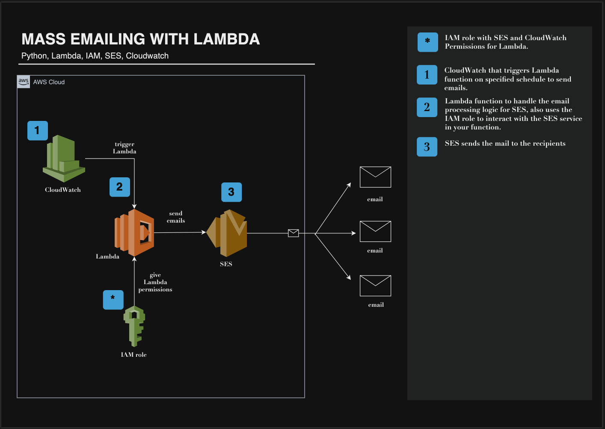
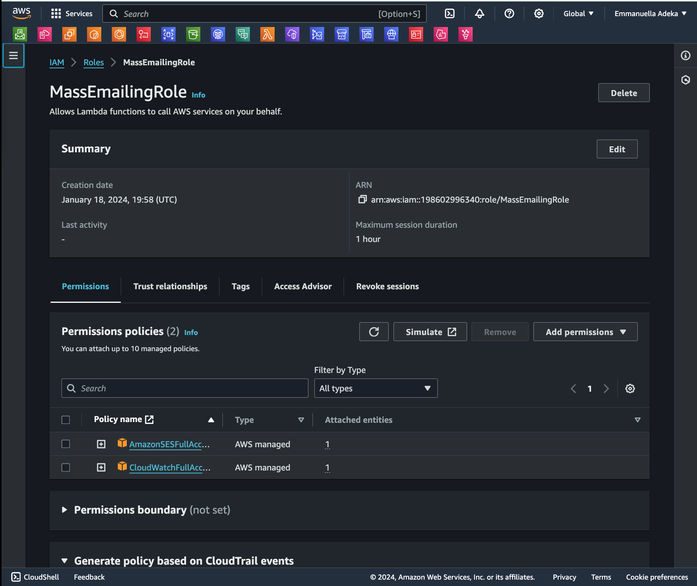
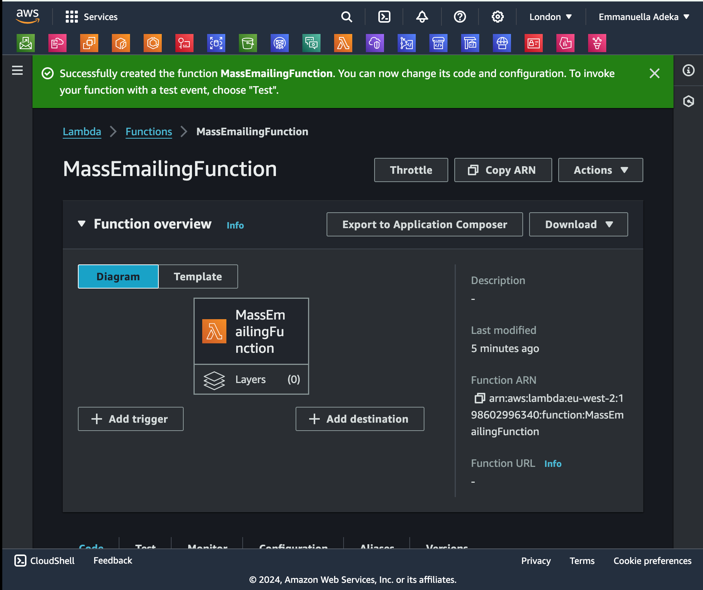
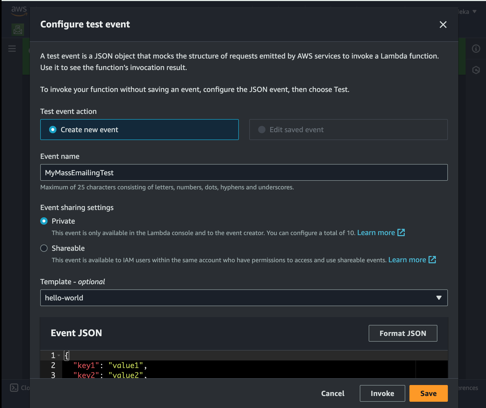
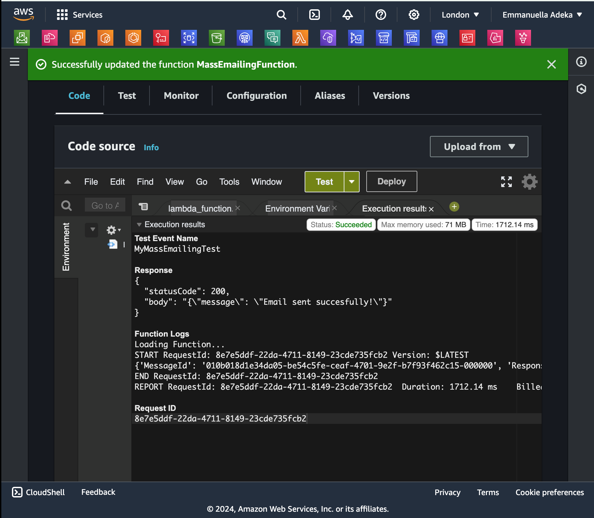
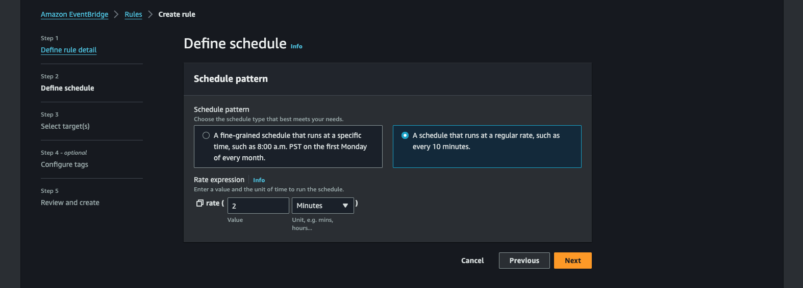
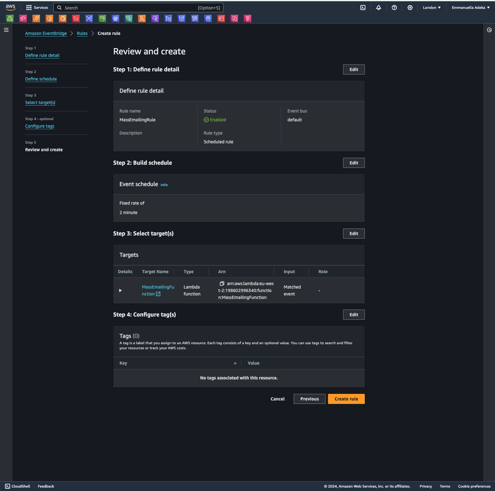
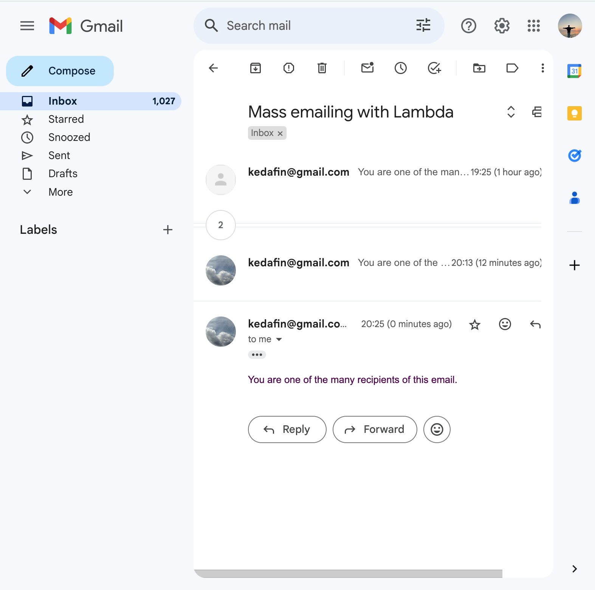

# MASS EMAILING WITH LAMBDA

# Blog


## Services
- Lambda
- SES
- IAM
- CloudWatch

## Architecture


## Steps
### 1. Create an IAM role
- Navigate to IAM and search for "Roles" in the side bar.
- Click "Create role"
- Leave Trusted entity type as "AWS service"
- Choose "Lambda" as the service to give permission to Lambda to perform actions in your account.
- Click "Next"
- Add the following permissions:
    - CloudWatch - FullAccess (not V2)
    - SES - FullAccess
- Click "Next"
- Enter role name as "MassEmailingRole"
- Review your configuration
- Click "Create role"


### 2. Create a Lambda Function
- Navigate to Lambda
- Create function
- Leave as "Author from scratch"
- Enter function name as "MassEmailingFunction"
- Choose the latest Python version as Runtime
- Click on "Change default execution role"  dropdown
- Choose "Use an existing role"
- Choose an existing role "MassEmailingRole"
- Create Function


### 3. Configure SES
If you have already configured SES prior to this, feel free to skip this step
- Navigate to SES in the Management Console
- Create SMTP Credentials
- Click SMTP Credentials
- Create User (under smtp)
- Retrieve SMTP credentials by downloading a .csv file or by copying the credentials and storing them in a file.
- Click "Return to SES Console".
- Click Verified Identities
- Click "Create new identity"
- Set identity type to "email"
- Enter email address
- Click "Create Identity"
- To verify ownership of the identity, check the inbox of the email you entered.
- Click the link in the email to verify the email address.

### 3. Configure the Lambda Function
```python 
import boto3
import json

print("Loading Function...")

def lambda_handler(event, context):
    # Initialize the Simple Email Service (SES) client in the specified AWS region
    ses = boto3.client("ses", region_name="eu-west-2")
    
    # Define sender and recipient email addresses
    sender_email = 'abc@gmail.com'
    recipient_email = 'def@gmail.com'
    
    # Compose email subject and message
    subject = "Mass emailing with Lambda"
    message = "You are one of the many recipients of this email."
    
    # Send email with SES
    response = ses.send_email(
        Source=sender_email,
        Destination={'ToAddresses': [recipient_email]},
        Message={'Subject': {'Data': subject}, 'Body': {'Text': {'Data': message}}}
    )
    print(response)
    
    return {
        'statusCode': 200,
        'body': json.dumps({'message': 'Email sent succesfully!'})
    }
```

- Configure test event
- Set Event name as "MyMassEmailingTest"
- Leave Event sharing settings as "Private"
- Click "save"

- Click "Deploy""
- Click "Test"


### 5. Create a CloudWatch Event 
- Navigate to CloudWatch > Events > Rules
- Click "Create rule"
- Enter rule name as "MassEmailingRule"
- Choose "Rule type" as "Schedule"
- Click on "Continue to create rule"
- Choose "A schedule that runs at a regular rate, such as every 10 minutes."
- Enter rate as 2 minutes

- Click Next
- Select "target type" as lambda function
- Choose "MassEmailingFunction"
- Click on Skip to review and create
- Create Rule


## Check your mail!!
